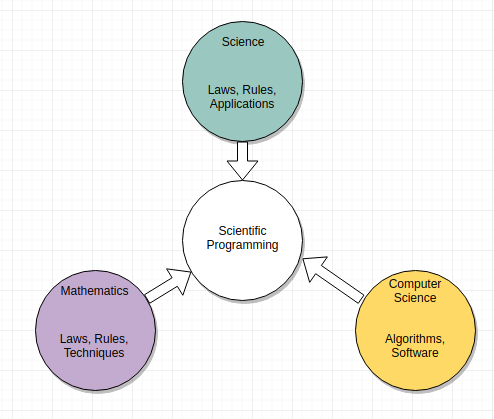

# Introduction to Scientific Computation Using Python

by [Arun Prasaad Gunasekaran](https://arunprasaad2711.github.io)

## Table of Contents

<!-- TOC -->

- [Introduction to Scientific Computation Using Python](#introduction-to-scientific-computation-using-python)
  - [Table of Contents](#table-of-contents)
  - [What is this playlist about?](#what-is-this-playlist-about)
  - [Why am I making this? - Part 1](#why-am-i-making-this---part-1)
  - [Why am I making this? - Part 2](#why-am-i-making-this---part-2)
  - [Reference Books](#reference-books)
  - [Note about references](#note-about-references)
  - [Software Requirements](#software-requirements)
    - [My setup](#my-setup)
  - [Idealogy](#idealogy)
  - [We'll be dealing with](#well-be-dealing-with)
  - [Final note before we get started,](#final-note-before-we-get-started)
  - [Are you ready?](#are-you-ready)

<!-- /TOC -->

## What is this playlist about?

* A reference guide for people who wants to learn and use Python for scientific computation.
* A personal initiative to address a lot of concepts and make programming feasible to a lot of students.

## Why am I making this? - Part 1

* To help people break their fear of programming.
* To equip people with sufficient tools for their scientific or applicational requirements.

## Why am I making this? - Part 2

* A **_challenge_** to myself to write and practice code for scientific computation.
* An attempt for me to go back to the basics and re-emerge to the advanced concepts with a lot of applications.
* To break my fear of failure.
  
## Reference Books

For now, a majority of the ideas will be inspired from the two books below:

* Computational Physics - Problem Solving with Python, Third Edition, Rubin H. Landau, Manuel J, Paez, and Cristian C. Boudeianu, Wiley Publications
* A Primer on Scientific Programming with Python, Third Edition, Hans Petter Langtangen, Springer

## Note about references

* In the future, I'll add more references and examples.
* You need not have the references! :D. If you have it, then its a bonus!
* I'll provide any additional references if content were taken outside of these books.

## Software Requirements

* Must have a working installation of Python 3 installed in Windows/Linux/MacOS.

**Personal Recommendation**: Python from [Anaconda/Miniconda](https://www.anaconda.com/distribution/) or from Python from [Enthought Canopy](https://www.enthought.com/product/canopy/) Distributions.

These distributions of python are designed specifically for scientific computation and have a collection of many commonly used packages and software at your disposal.

* One good Interactive Development Environment (IDE) for coding.

**Personal Recommendation**: [Spyder](https://www.spyder-ide.org/), [Pycharm](https://www.jetbrains.com/pycharm/)

### My setup

* Linux - Ubuntu 18.04 LTS 64-bit
* Python - Anaconda Python Distribution - Python 3.7+
* IDE - PyCharm

## Idealogy

```sequence
Science->Scientific Programming: Laws, Rules, Applications
Mathematics->Scientific Programming: Laws, Techniques
Computer Science->Scientific Programming: Algorithms, Software
```



## We'll be dealing with

* Data Visualisation,
* Making simple models,
* Running simulations,
* Numerical Experiments,
* Analysis of Experimental data,
* Inferences from the data

## Final note before we get started,

* Do experiment!
* Point-out mistakes if I made!
* Feel free to give suggestions (I'll try my best to incorporate them)

## Are you ready?

Let's start then! :D
